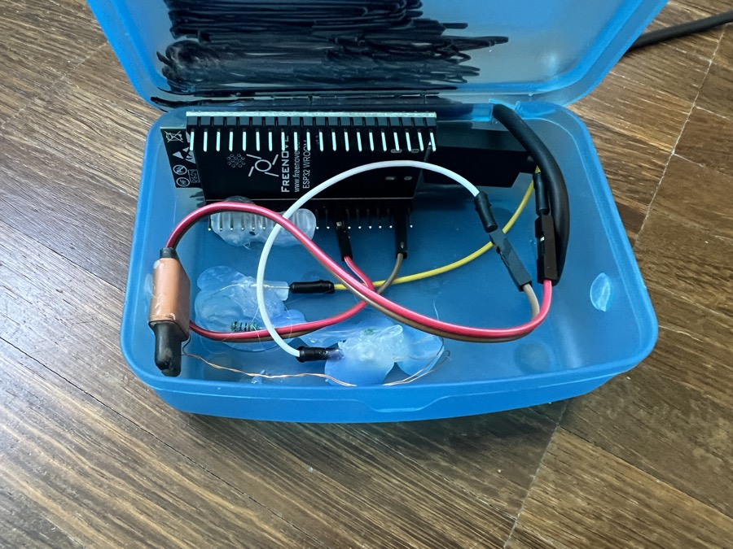
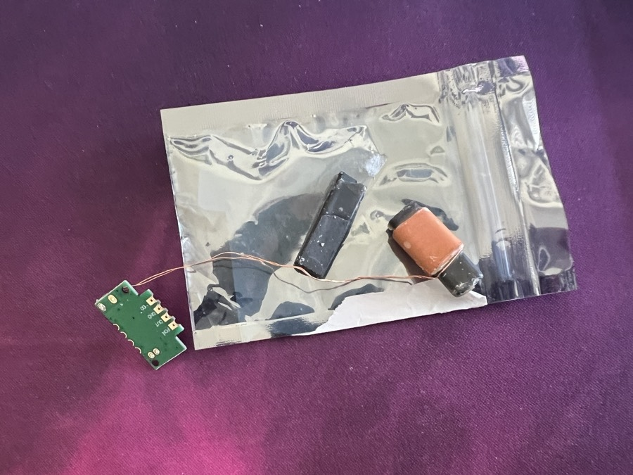
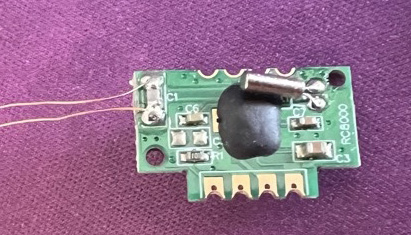
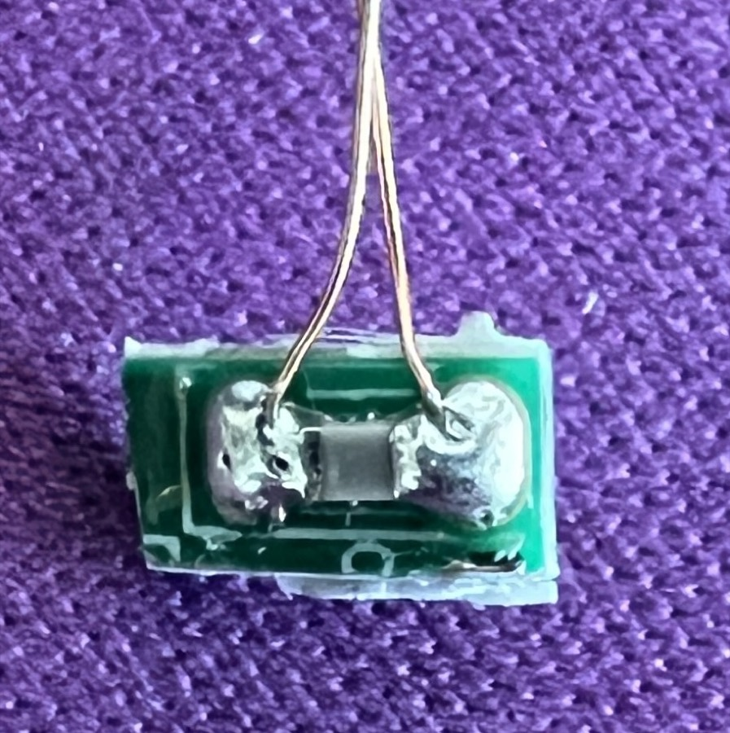
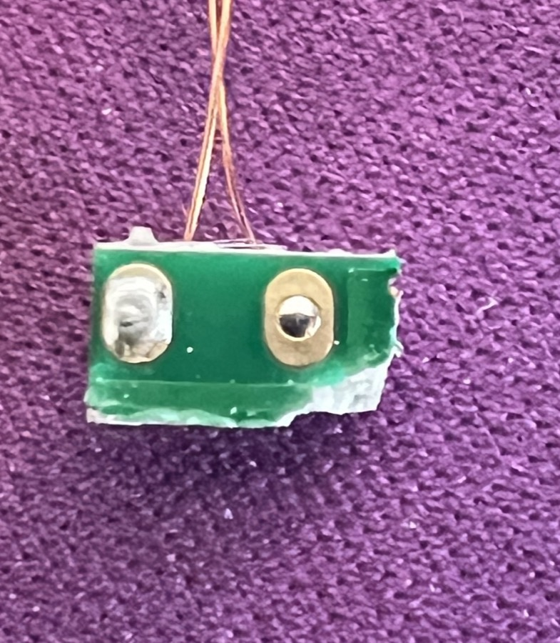
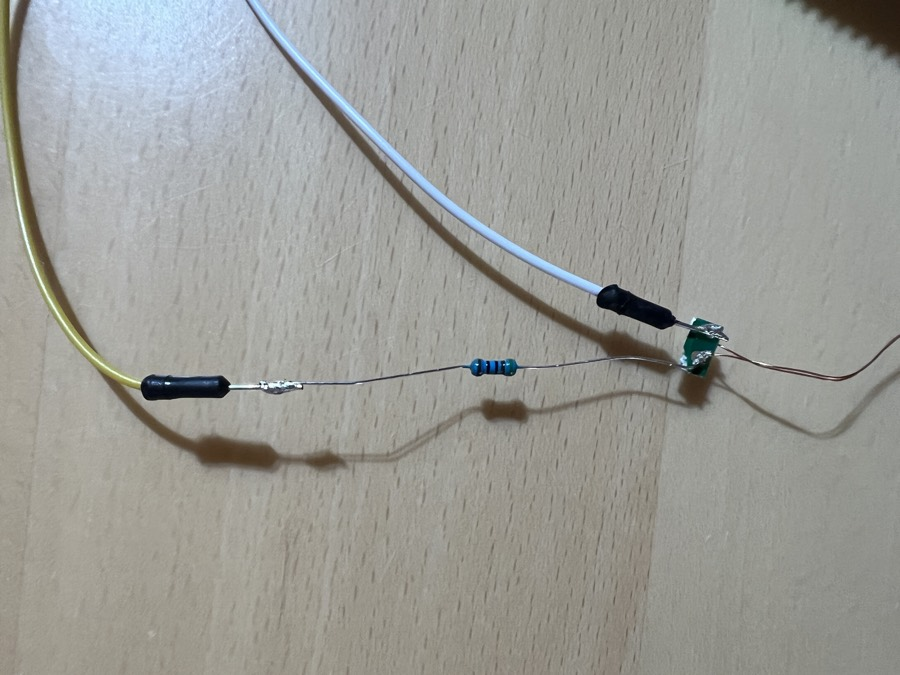
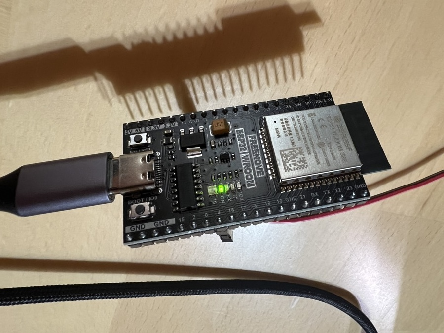
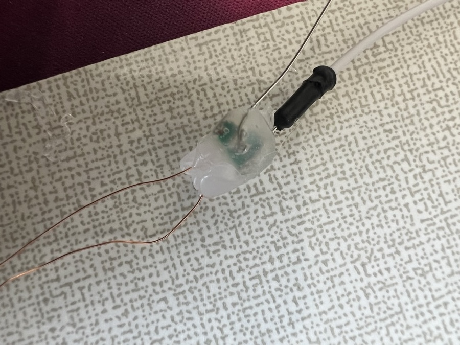
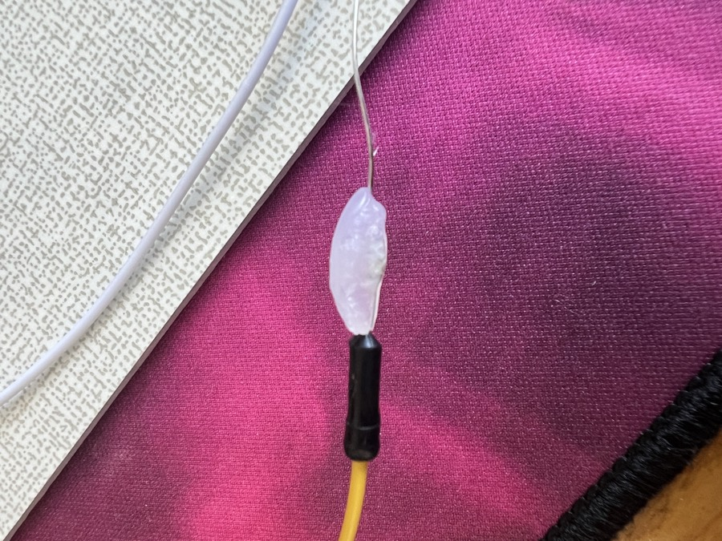

# DCF77 Mini-Transmitter (ESP32)

A tiny, NTP-disciplined DCF77 transmitter that feeds a radio-controlled clock
with a clean 77.5 kHz time signal from a few centimeters away, for clocks
that sit in a reception dead spot and drift off (in my case: a Technoline
projection clock that was suddenly an hour behind).

Time comes from NTP over WiFi, using the PTB time servers, the same
institute that runs the real DCF77 transmitter in Mainflingen. So the clock
ends up synced to the same source, just via a much shorter last mile.



## How it works

- The ESP32 generates the 77.5 kHz carrier directly with LEDC PWM (50 % duty).
- DCF77 is amplitude modulation: at the start of each second the carrier is
  dipped for 100 ms (bit = 0) or 200 ms (bit = 1); second 59 has no dip
  (minute marker). 59 bits per minute encode the following minute's time and
  date in BCD with three even-parity bits.
- The antenna is a 77.5 kHz resonant tank (ferrite coil + tuning capacitor)
  salvaged from a cheap DCF77 *receiver* module, driven through a series
  resistor. Range is intentionally a few centimeters.
- NTP keeps the ESP32's clock disciplined indefinitely; the wall clock then
  syncs off the transmitter every night as if it stood next to Mainflingen.

## Parts

| Part | Source |
|---|---|
| ESP32 dev board | Freenove ESP32-WROOM |
| Ferrite antenna + tuning cap | salvaged from an SP6007-style DCF77 receiver module |
| 510 Ω resistor (anything from about 470 Ω to 1 kΩ works) | resistor kit |
| Hot glue, wire, USB power brick | junk drawer |

## Antenna surgery

The donor was a broken receiver module (snapped ferrite rod, doesn't
matter, see FAQ):



The important insight: the ferrite coil **together with its parallel tuning
capacitor** forms the resonant tank at 77.5 kHz. On this module the cap is
the SMD part labeled **C1**, sitting directly between the two pads where the
coil wires arrive:



Instead of desoldering C1 and soldering it to hair-thin enameled wire, cut
the PCB just past C1 and keep the left strip: both solder pads (coil wires
already attached), C1, done. The receiver chip, crystal filter and the rest
go in the bin.

| Back: coil wires + C1 | Front: through-hole pads for the feed |
|---|---|
|  |  |

Solder the feed to the gold pads on the *front* side: big pads, no heat
near C1, and no mechanical stress on the fragile coil wires.

## Wiring

```
ESP32 GPIO 4 ──[ 510 Ω ]──► pad 1 ─┬─ coil ─┬─ pad 2 ──► GND
                                   └── C1 ──┘   (parallel tank)
```

Pad/lead order doesn't matter anywhere; resistor and antenna are symmetric.




The series resistor limits the GPIO current to ~6 mA, safe for the ESP32 in
every miswiring scenario, and it keeps the radiated power in the
nano-to-microwatt range, so the signal stays inside your room.

After verifying everything works: pot the antenna board, the resistor and
all solder joints in hot glue (non-conductive) and glue the blob to the
ferrite rod for strain relief.

| Potted antenna board | Potted resistor |
|---|---|
|  |  |

## Build & flash

```sh
cp include/config.example.h include/config.h   # then edit WiFi credentials
pio run -t upload
pio device monitor
```

The monitor shows WiFi/NTP progress and one line per minute with the frame
being transmitted, e.g.:

```
Encoding next minute: 2026-07-11 14:12 CEST | bits: 000000000000000001001010010000010...
```

## Deployment

Place the ferrite rod a few centimeters from the clock, **parallel** to the
clock's internal antenna, and trigger a manual sync. A clean sync takes 2 to
5 minutes. Coupling is strongly directional: if nothing happens, rotate the
rod and vary the distance (2 to 15 cm) before suspecting anything else. Once
the position works, fix it in place; the clock will re-sync every night.

Plastic, wood or cardboard enclosures don't attenuate the field at all.
Metal does, so keep sheet metal and foil away from the antenna.

## Test mode

`FAKE_TIME` in [src/main.cpp](src/main.cpp) transmits a deliberately wrong
time-of-day, starting at `FAKE_HOUR:FAKE_MINUTE` and counting up normally
from there. When the clock jumps to 3:33, you *know* it's your signal and
not Mainflingen. Set the flag back to 0 for production.

Why counting up matters: clocks validate reception by comparing consecutive
frames, and the second one must read exactly minute + 1. A frozen fake time
is silently rejected forever.

## Lessons learned

1. **Full-off carrier dips beat the 15 % spec at close range.** The real
   transmitter dips to 15 % amplitude; this firmware initially did the same
   (5 % PWM duty gives roughly 15 % fundamental). The clock detected seconds
   but never accepted a frame: at centimeter distance the receiver's AGC
   flattens a partial dip. Switching to carrier-fully-off
   (`DUTY_REDUCED = 0`) fixed it immediately. Don't "restore spec behavior"
   without retesting.
2. **Frozen test times are never accepted** (see Test mode above).
3. **A blinking reception icon on the clock is a signal-presence detector,
   not a decode indicator.** Pulling the transmitter's power and watching
   the icon stop blinking is a great causality test.

## FAQ

Real questions asked during this build.

#### Which WiFi, 2.4 GHz or 5 GHz?
2.4 GHz only. The ESP32-WROOM has no 5 GHz radio.

#### 470 Ω or 1 kΩ for the series resistor?
Doesn't matter much. 470 Ω gives roughly twice the field of 1 kΩ and is
still only ~7 mA GPIO current. 510 Ω (used here) is indistinguishable from
470 Ω in practice (~8 % difference). Adjust distance, not resistance.

#### Does the resistor's orientation matter?
No, resistors have no polarity. Same for the antenna: either pad can go to
the resistor or GND.

#### The donor module is broken, ferrite rod snapped in half. Trash?
No! A broken module is the perfect antenna donor (keeps your good module as
a spare). A snapped ferrite rod glues back together with superglue at
negligible magnetic loss, and even half a rod works at centimeter range.
Only torn coil wires are fatal.

#### So I just cut off the PCB?
Almost. First locate the tuning capacitor (C1); without it the coil is not
resonant and nearly useless. Cut the board so that both antenna pads *and*
C1 survive as one piece.

#### Which side do I solder the feed wires to?
The front side with the two gold through-hole pads, i.e. the side without
C1 and the coil wires. Electrically identical (the pads are through-plated),
but the big gold pads take solder easily and the iron never gets near C1 or
the fragile enameled wires.

#### Can something break if I wire it up wrong?
Practically no. The series resistor limits every miswiring scenario
(swapped pins, wrong GPIO, accidental 3.3 V/5 V) to a few harmless
milliamps. The only real ESP32 killer, 5 V directly into a GPIO without a
resistor, can't occur in this topology.

#### Does it transmit continuously or once per minute?
Continuously. The carrier never stops; one bit is sent per second, a full
time frame takes exactly one minute and repeats endlessly. The serial log
prints once per minute, that's all.

#### Can the weak real DCF77 signal interfere?
In theory both signals superimpose at 77.5 kHz. In practice the near field
at a few centimeters is orders of magnitude stronger than Mainflingen from
hundreds of km, and the receiver's AGC locks onto the dominant signal. If in
doubt, move closer (field grows with ~1/r³). Fun fact: a marginal *real*
signal with a mis-decoded CEST/CET bit is a classic cause of a clock being
exactly one hour off, which is the original problem this project solves.

#### Is the broken ferrite rod a problem for transmission?
No. Maybe a factor 1.5 to 3 in field strength, which 2 cm less distance
more than compensates. Glued halves lose almost nothing.

#### Can I pot everything, board, joints, even the resistor, in hot glue?
Yes. Hot glue is non-conductive and the resistor dissipates under 10 mW
(4 % of its rating), so heat buildup is a non-issue. Pot after the final
functional test, and make sure the two enameled coil wires don't touch
bare-to-bare where you freeze them in place.

#### How do I tell where the enamel insulation has burned off?
Intact enamel is matte dark red-brown; bare copper is bright and shiny,
tinned spots are silver. Electrically: continuity beeper from a pad to the
side of the wire, since enamel isolates even against probe tips. Typically
only 1 to 3 mm around solder joints are affected.

#### The transmitter sits right next to my bed. Health concerns?
No. Radiated power is in the nano-to-microwatt range at 77.5 kHz
(non-ionizing longwave), unmeasurable at pillow distance. The strongest
transmitter in the box is the ESP32's WiFi at ~100 mW peak, the same as
any smart plug. All of it is orders of magnitude below ICNIRP limits.

#### Does a plastic enclosure shield the signal?
Not at all. Plastic, wood, glass and fabric are fully transparent to a
77.5 kHz magnetic field. Only conductive material (sheet metal, foil)
attenuates it via eddy currents. Position and rod orientation matter far
more than the box.

#### Can I turn off the LEDs?
The blue LED (GPIO 2, mirrors the modulation dips) is firmware-controlled:
`LED_BLINK` in [src/main.cpp](src/main.cpp), off by default. The green
power LED is hardwired to the 3.3 V rail and can't be disabled in software;
a strip of black tape or a dab of nail polish is the accepted engineering
solution.

## Legal note

The transmit power through the series resistor is minuscule and the range a
few centimeters. This doesn't radiate beyond your desk and won't disturb
anyone else's reception. Keep it that way: no amplifiers, no big antennas.
